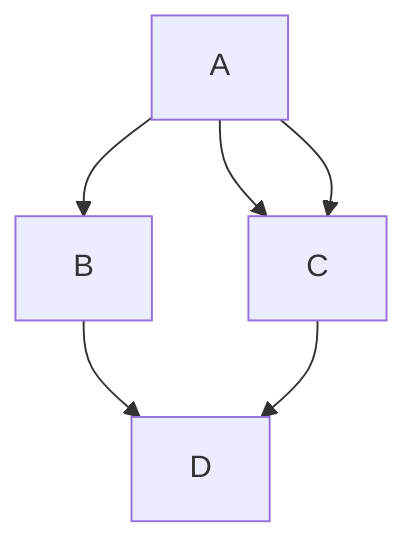

# My Personal MD Cheatsheet

## Headers
```
# H1
## H2
### H3
#### H4
##### H5
###### H6
```
---
## Emphasis

Italics, with *asterisks* or _underscores_.

Strong emphasis, aka bold, with **asterisks** or __underscores__.

Combined emphasis with **asterisks and _underscores_**.

Strikethrough uses two tildes. ~~Scratch this.~~
___

## Lists

1. A
    * Unordered List
    * Unordered List

2. B

---
## Links

[I'm an inline-style link](https://www.google.com)

[I'm an inline-style link with title](https://www.google.com "Google's Homepage")

[I'm a reference-style link][Arbitrary case-insensitive reference text]

[I'm a relative reference to a repository file](../blob/master/LICENSE)

[You can use numbers for reference-style link definitions][1]

Or leave it empty and use the [link text itself].

URLs and URLs in angle brackets will automatically get turned into links. 
http://www.example.com or <http://www.example.com> and sometimes 
example.com (but not on Github, for example).

Some text to show that the reference links can follow later.

[arbitrary case-insensitive reference text]: https://www.mozilla.org
[1]: http://slashdot.org
[link text itself]: http://www.reddit.com

| Tables        | Are           | Cool  |
| ------------- |:-------------:| -----:|
| A      | B | C


---

> Quote

<!---
Comentario
-->

Line (---)

---
[*]() Hola

**Code**

```javascript
var s = "JavaScript syntax highlighting";
alert(s);
```
---
- Hola
- [ ] List


---
:+1:




